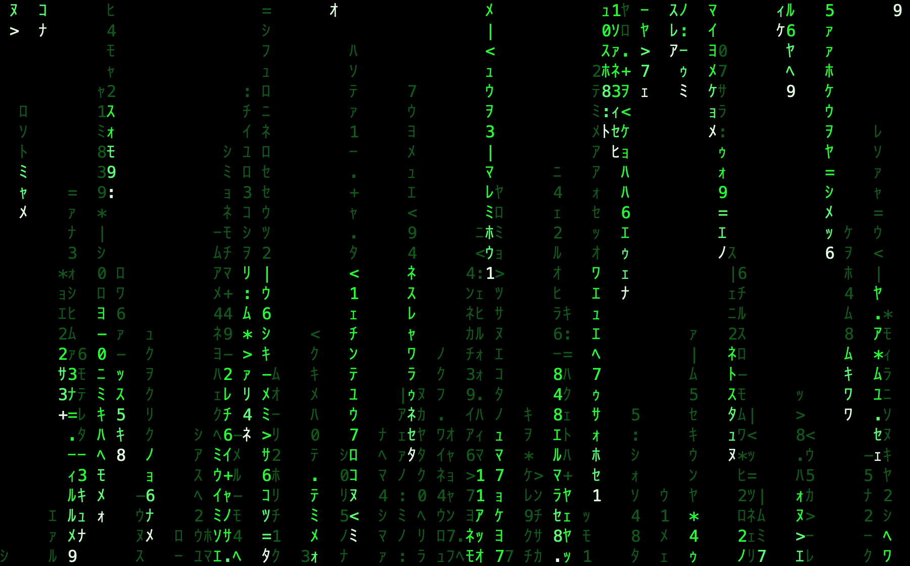

# matrix-theme-kit

Turn a whole Mac phosphor green (`#00ff41` on near-black) with one command.

**[Live demo — The Operator's Rig](https://claude.ai/code/artifact/1a2eefeb-02f1-49b4-9f88-1efcd8ac6c92)** —
an interactive tour of the kit with the code rain, the animated katakana
statusline, and the spinner verbs running live in your browser.



## What you get

- **Live code-rain wallpaper** — a native Swift app that rains behind your
  desktop icons at native Retina scale, pauses when covered or while the
  screensaver runs, and survives login races.
  **⌃⌥⌘M** launches the matching **screensaver** on demand.
- **Ghostty** theme with a GLSL shader that rains *behind* your terminal text
  (with a halo so text stays readable), plus matching **Terminal.app** profiles.
- **SketchyBar HUD** — braille logo, `「 App 」` front-app, an animated 21-cell
  code-rain strip, kanji-labeled CPU/battery, a `08.29（金）14:52:03` clock, and
  a LINE SECURE badge that appears only while secure keyboard input is active.
- **zsh**: green prompt with git branch, a typed "Wake up, Neo…" greeting,
  green `ls`/`bat` colors, and a `rain` alias (cmatrix).
- **Vim** colorscheme, standalone `matrix` rain script for any terminal,
  green system accent, and an alert sound (synthesized warble by default —
  see below).
- **Claude Code** (if installed): full green theme, katakana statusline with
  context/usage meters, Matrix spinner verbs in English and katakana, Oracle
  tips, and a "— TRANSMISSION COMPLETE —" stop hook.

## Install

```
git clone https://github.com/ninjadogg/matrix-theme-kit
cd matrix-theme-kit && ./install.sh
```

Re-running is safe: every step is idempotent, originals are backed up
(`~/.zshrc.pre-matrix`, timestamped Ghostty backup, Claude
`settings.json.pre-matrix`), and steps with missing prerequisites are skipped
with a note.

**Requirements:** macOS 13+. Xcode Command Line Tools for the
wallpaper/screensaver build (`xcode-select --install`). Homebrew recommended
for `bat`/`cmatrix`/`sketchybar` (there's a direct-download fallback for most
of them). [Ghostty](https://ghostty.org) if you want the shader terminal.

Nothing needs `sudo`, and nothing is bundled: the Cica font and CLI tools are
fetched from their official releases at install time, and the
wallpaper/screensaver compiles from the Swift source in this repo.

## The phone ring

The kit installs an original synthesized two-tone warble as the alert sound.
If you'd rather hear the actual movie ring, obtain it yourself, drop it next
to `install.sh` as `matrix-ring.mp3` (or `.aiff`/`.m4a`/`.wav`), and re-run —
the installer converts and uses it. No movie audio ships in this repo.

## What it touches

| Step | Where |
|---|---|
| zsh prompt/greeting/aliases | appended block in `~/.zshrc` |
| Vim colorscheme | `~/.vim/colors/`, `~/.vimrc` |
| Cica font (downloaded) | `~/Library/Fonts/` |
| Ghostty config + shader | `~/.config/ghostty/` |
| Terminal.app profiles | imported; "Matrix" set default |
| CLI tools | Homebrew, or `~/.local/bin/` |
| SketchyBar HUD | `~/.config/sketchybar/` + LaunchAgent `local.matrix.sketchybar` |
| Accent/highlight, alert sound | user defaults, `~/Library/Sounds/` |
| Wallpaper app (built from source) | `~/.claude/matrix-saver/` + LaunchAgent `local.matrixrain.wallpaper` |
| Screensaver (built from source) | `~/Library/Screen Savers/MatrixRain.saver` |
| Claude Code | merged into `~/.claude/settings.json`, `~/.claude/themes/` |

## Uninstall

```
launchctl bootout gui/$(id -u)/local.matrix.sketchybar
launchctl bootout gui/$(id -u)/local.matrixrain.wallpaper
rm ~/Library/LaunchAgents/local.matrix{.sketchybar,rain.wallpaper}.plist
rm -rf ~/Library/Screen\ Savers/MatrixRain.saver ~/.claude/matrix-saver
mv ~/.zshrc.pre-matrix ~/.zshrc
```

Then re-pick your accent color, alert sound, and Terminal profile in System
Settings. Claude Code settings back up to `~/.claude/settings.json.pre-matrix`.

## Performance

Measured on an M1 MacBook Air, on battery with Low Power Mode active:

| State | Cost |
|---|---|
| Wallpaper covered by opaque windows | 0 frames drawn, ~0.1% of one core |
| Wallpaper visible | steady 12 fps at native Retina scale (strict dispatch timer — Low Power Mode can't coalesce it) |
| Screensaver while displayed | ~20% of one core (full-screen 1:1 glyph sprites at 12 fps) |
| After the screensaver is dismissed | lingering `ScreenSaverEngine`/`legacyScreenSaver` processes swept within 8 s |

The sweep matters: macOS never tells the screensaver appex to stop, so
without it the rain keeps rendering offscreen forever — the stock behavior
costs a third of a core, invisibly, until reboot. Both apps render via
pre-rasterized per-glyph CGImage sprites; the desktop and saver share one
grid so they look identical.

## Notes & quirks

- SketchyBar runs with `topmost=window`; if an app launched later covers it,
  click the braille logo to restart the bar. No bar in fullscreen Spaces
  (macOS behavior) — the Ghostty config uses non-native fullscreen so the HUD
  stays visible there.
- The wallpaper app is unsigned (ad-hoc, built on your machine); macOS may ask
  for approval under Privacy & Security on first login.

## Credits

Downloads at install time (not bundled): [Cica](https://github.com/miiton/Cica)
(SIL OFL 1.1) · [bat](https://github.com/sharkdp/bat) (MIT/Apache-2.0) ·
[cmatrix](https://github.com/abishekvashok/cmatrix) (GPLv3) ·
[SketchyBar](https://github.com/FelixKratz/SketchyBar) (Apache-2.0). See
`THIRD_PARTY_NOTICES.md`. Everything in this repo is original work, MIT
licensed. *The Matrix* is a Warner Bros. property; this is an unaffiliated
fan theming project that includes no assets from the films.
